<!-- Canonical repository copy of the approved Cursor roadmap. -->
<!-- Update this file and the Cursor plan together when strategy changes. -->

# Systems Engineering Masterclass Roadmap

## Goal and boundaries
- Primary outcome: become a strong Linux kernel programmer with deep C, system-programming, debugging, driver, memory-management, concurrency, and virtualization skills.
- Career positioning: Linux kernel/platform developer with broad subsystem competence, KVM/x86/AMD virtualization depth, and evidence of original development—not a narrowly branded SEV-SNP-only specialist.
- Build one connected model: physical state → gates → CPU/ISA → C/toolchain → OS → Linux kernel/drivers → storage/networking/virtualization.
- Use history to explain why each abstraction appeared, but avoid detached timelines.
- Use only the chip-design depth needed to understand CPU/system behavior; do not drift into analog IC or HDL specialization.
- Build a guided ToyOS to reconstruct known mechanisms, not invent a production OS.
- Treat distributed systems, cloud, and AI infrastructure as deferred context pieces—not the main track, near-term capstone, or reason to dilute kernel depth.
- Treat memory ordering, NUMA/data movement, Linux isolation/resource control, storage and network paths, virtualization/confidential computing, and observability as required cross-layer systems threads—not optional breadth.
- Make kernel/systems interview readiness an explicit secondary outcome: every major concept must be explainable concisely, traceable on a whiteboard, implementable in C where relevant, and defensible through trade-offs and debugging evidence.
- Immediate priority is foundation confidence. Do not activate specialization pivots, market-driven detours, ToyOS expansion, or upstream patch targeting until the corresponding confidence gate is met.
- Treat each “week” as a mastery module, not a calendar deadline.

```mermaid
flowchart LR
  physics[PhysicalState] --> logic[GatesAndTiming]
  logic --> cpu[CPUAndMicroarchitecture]
  cpu --> isa[ISAAndMachineCode]
  isa --> ctool[CAndToolchain]
  ctool --> toyos[ToyOSAndOS]
  toyos --> linux[LinuxKernelAndDrivers]
  linux --> systems[StorageNetworkingVirtualization]
  systems -.-> later[DeferredCloudAndAIContext]
```

## Phase 1 — Refresh and unify foundations
Use the completed learner-facing modules:
- [Week 1](../01-foundations-to-cpu/week-01-material.pdf): physical representation through CPU control, exceptions, and privilege.
- [Week 2](../02-assembly-memory-and-c/week-02-material.pdf): x86/RISC-V assembly, ABI, memory hierarchy, cache, NUMA, and C’s abstract machine.
- [Week 3](../03-c-toolchain-and-startup/week-03-material.pdf): pointers/lifetime through object files, linking, ELF loading, and startup.

Completion gate for each module:
- Explain the causal model without notes.
- Draw the critical control/data flow.
- Complete interactive theory checks and practical labs.
- Debug at least one failed prediction.
- Reimplement or extend one lab rather than only running it.

### Foundation Gate A — CPU, C, assembly, and toolchain clarity
Do not move the active focus beyond Weeks 1–3 until the learner can:
- trace a simple C expression through compiler output, ISA-visible state, and CPU execution;
- read basic x86-64 assembly, calling convention, stack frames, and object/ELF metadata;
- explain cache/TLB/NUMA and C type/lifetime/alignment effects without slogans;
- write and debug warning-clean C involving pointers, aggregates, allocation, cleanup, and multiple translation units;
- complete the practical labs and explain at least one failed prediction from each module.

## Phase 2 — Necessary CPU/chip depth
Use:
- [Week 4](../04-cpu-and-chip-design/week-04-material.pdf): MOSFET/CMOS, restoring gates, delay/power, sequential timing, one minimal RTL exercise, and one synthesis observation.
- [Week 5](../05-riscv-cpu-microarchitecture/week-05-material.pdf): RV32I datapath/control, runnable tiny core, pipeline/hazards, cache/TLB/MMU, and end-to-end C-to-transistor trace.

Exit artifact:
- Explain and demonstrate how `c = a + b` becomes compiler output, instruction bytes, decoder/control signals, ALU paths, gate transitions, and captured register state.
- Modify the teaching CPU or pipeline model and explain the architectural versus microarchitectural effect.

### Foundation Gate B — hardware/software boundary
Before beginning ToyOS or subsystem specialization, demonstrate:
- one transistor/gate/timing explanation grounded in simulation evidence;
- one RTL-to-netlist observation without confusing RTL, gates, placement, or physical transistors;
- a cycle-by-cycle trace through the teaching RISC-V core;
- pipeline/hazard/cache/TLB reasoning tied back to a C task;
- a clear statement of which facts belong to architecture, microarchitecture, OS policy, or physics.

## Phase 3 — Guided ToyOS and OS foundations
Create the next topic packages only after evidence from Phases 1–2:
- `06-toyos-bootstrap-and-exceptions/`: freestanding C, linker script, boot contract, stack, serial output, GDT/TSS/IDT, exception stubs, QEMU/GDB.
- `07-memory-processes-and-scheduling/`: memory map, page-frame allocator, paging, kernel heap, task state, context switching, timer, cooperative then preemptive scheduling.
- `08-user-mode-syscalls-and-ipc/`: ring 3, syscall entry, user copies, address spaces, ELF user loader, signals, pipes/shared memory, descriptor table.
- `09-filesystems-and-virtual-devices/`: ramfs/VFS concepts, block I/O path, PCI/MMIO/interrupts/DMA, optional virtio.

Every milestone follows:
- Question → design → predict → implement → observe → break/debug → compare with xv6 → compare with Linux.
- Keep milestones small, reproducible, serial-testable, and tagged in Git.
- Maintain debug and release-style builds; use QEMU snapshots, serial logs, GDB scripts, symbolized exception dumps, and deliberately injected faults from the first boot milestone.

### Foundation Gate C — operating-system mental model
Specialization becomes active only after the learner can:
- trace syscall, exception, interrupt, page-fault, scheduling, and return paths;
- explain process/thread/address-space/task-state relationships;
- implement and debug simplified allocation, paging, context-switching, syscall, and descriptor mechanisms in ToyOS or bounded simulators;
- compare the same mechanism across ToyOS, xv6, and Linux;
- diagnose at least one injected ToyOS fault from evidence to regression test.

## Phase 4 — Linux kernel and driver depth
Follow the authoritative curriculum in [curriculum-tracker.docx](../metadata/curriculum-tracker.docx), using current kernel source/docs over stale book APIs.
- Kernel build/boot/modules and syscall entry.
- `task_struct`, scheduler, interrupts/softirqs/workqueues.
- Mutex/spinlock/atomics/RCU, cache coherence, compiler and CPU memory ordering, barriers, and lock-free/per-CPU reasoning.
- Buddy/SLUB/vmalloc/reclaim/OOM/NUMA.
- Device model, sysfs, character devices, ioctl/poll/mmap.
- CPU topology, NUMA placement, PCIe, MMIO, IRQ/MSI-X, DMA, IOMMU, and RDMA data paths; then GPIO/I2C/SPI when hardware is available.
- Use consistency vocabulary carefully: transfer intuition from coherence/memory models to distributed systems only after stating where the models and failure assumptions differ.

Evidence should come from source traces, perf/PMUs, ftrace/trace-cmd, eBPF, controlled modules/drivers, and written ToyOS↔xv6↔Linux comparisons. Every kernel subsystem module must include at least one deliberate fault or diagnostic investigation, not only a working implementation.

### Subsystem focus
- Default differentiator—not an irreversible commitment: KVM, x86/AMD architecture code, SEV/SEV-ES/SEV-SNP, nested paging, vCPU state, IOMMU, and confidential-computing paths.
- Required core-kernel depth: CPU scheduling and task lifecycle, plus memory management and platform/RAS where they intersect virtualization and AMD platform behavior.
- Supporting breadth: PCIe, DMA, interrupts, device model, locking, tracing, and testing required to make primary-subsystem changes safe.
- Employable base: remain qualified for broader kernel/platform, sustaining-to-development, performance, driver, and virtualization roles; contribution work should concentrate enough to build maintainer-level context without making the resume dependent on one niche feature.

## Practical career pivot and market validation

This phase is planned now but activated only after Foundation Gates A–C.

### Target a role cluster, not one job title
- Primary applications: Linux Kernel Engineer, Kernel/Platform Software Engineer, Linux Virtualization Engineer, KVM/QEMU Engineer, Server Platform Engineer, and Systems Software Engineer.
- Adjacent applications: PCIe/IOMMU/VFIO/virtio or AI-accelerator host software, kernel performance/NUMA/RAS, and kernel sustaining roles that include feature development.
- Backup market: embedded/BSP/device-driver roles only when the work and compensation are acceptable; do not pivot automatically just because raw posting volume is larger.

### Do not wait for course completion
- Continue passive market observation during foundation work. Begin targeted applications after the resume and first credible developer-evidence artifacts are ready; continue study, ToyOS, debugging, and upstream work in parallel.
- Review real job descriptions monthly and update skill priorities only when patterns repeat across multiple credible employers.
- Use applications as data: role response, recruiter feedback, technical-screen gaps, location constraints, seniority mismatch, and requested tools/subsystems.

### Market checkpoints
- Maintain a focused sample of suitable roles across India, remote, and relocation markets rather than using total global posting counts.
- After roughly 30–50 well-matched applications or 6–8 weeks—whichever provides useful signal—review:
  - response and interview rate;
  - which subsystem experience attracts interest;
  - repeated missing requirements;
  - whether seniority filters are the main blocker;
  - whether adjacent PCIe/driver/performance roles respond better than KVM-specific roles.
- If KVM/confidential roles are too sparse, broaden the positioning to kernel/platform development while retaining virtualization as differentiating evidence; do not discard the accumulated expertise.

### Adaptive subsystem decision gate
- Re-evaluate the primary specialization using a maintained sample of real roles, not social-media impressions or one company's hiring cycle.
- Compare at least these tracks:
  - **Virtualization/confidential computing:** strongest current fit; lower raw volume but high differentiation.
  - **Kernel networking/eBPF/security:** strong cloud/security demand; requires TCP/IP, netdev/XDP, BPF verifier/libbpf, Go, and container context.
  - **Embedded/BSP/drivers:** typically broadest raw volume, especially automotive/industrial/consumer; requires ARM, device tree, U-Boot, Yocto/Buildroot, peripheral drivers, and hardware bring-up.
  - **PCIe/accelerator host software:** growing AI-systems path; requires PCIe, DMA/IOMMU, interrupts, queues, VFIO/SR-IOV, NUMA, zero-copy, and driver performance.
  - **Storage/NVMe/networked storage:** steady enterprise demand; requires block layer, page cache/writeback, NVMe/NVMe-oF, RDMA/RoCE, multipath, and reliability debugging.
- Score each track on local/remote openings, required years, fit with existing evidence, time-to-credible-portfolio, genuine interest, and interview response.
- Change the primary track only when several weeks of data show a better practical path; do not chase individual job postings.
- Do not spend foundation time rotating through all proof-of-fit sprints. Activate them only after Gate C or when a concrete near-term role justifies one.

### Small proof-of-fit sprints
- Virtualization: KVM selftest/QEMU/SEV-SNP debugging or patch evidence.
- Networking/eBPF: trace one TCP path, write a small libbpf/XDP or tracing program, and explain verifier/performance behavior.
- Embedded/BSP: boot ARM64 QEMU with a custom kernel/device tree and implement or modify one simple platform/character driver; use real hardware later if chosen.
- Accelerator/PCIe: build a QEMU PCIe device plus Linux driver or a VFIO/IOMMU/DMA queue experiment.
- Keep each sprint bounded to roughly one or two weeks; use the result to test aptitude, interest, and market credibility rather than trying to master every track.

### Resume positioning
- Headline around Linux kernel/platform development, virtualization, x86/AMD, debugging, and performance—not “backport engineer” and not “confidential-computing specialist only.”
- Reframe backport work truthfully as engineering evidence: upstream design analysis, API adaptation, architecture/version differences, regression diagnosis, validation, collaboration, and production constraints.
- Clearly separate adaptation/backport ownership from original feature/fix authorship; never imply upstream design ownership that did not occur.
- Add new developer evidence as it is earned: original patches, tests, debugging reports, performance investigations, modules/drivers, QEMU/KVM changes, and public review.
- Prefer quantified outcomes: kernels/versions/platforms supported, failures diagnosed, regressions prevented, test coverage, performance impact, review/merge status, and cross-team scope.

### Resume variants without misrepresentation
- Maintain one verified evidence inventory and derive targeted variants from it:
  - **Kernel virtualization/platform:** KVM/QEMU, x86/AMD, SEV-SNP, MM/NUMA, debugging.
  - **Kernel networking/eBPF:** networking labs, tracing/BPF work, performance, containers, relevant kernel interfaces.
  - **Embedded/BSP/drivers:** C, modules/drivers, device tree, boot/kernel build, hardware interfaces, debugging.
  - **PCIe/accelerator systems:** PCIe/IOMMU/DMA/VFIO, queues, interrupts, NUMA, zero-copy, performance.
- Tailoring means changing headline, ordering, summary, selected projects, and keywords for a real role—not changing dates, titles, ownership, contribution status, or claiming unearned production experience.
- Label backports, original patches, test contributions, experiments, and upstream-reviewed work accurately and separately.

### Practical investment rule
- Spend most effort on transferable kernel skills: C, debugging, concurrency, memory, tests, Git/upstream workflow, performance, drivers, and hardware/software boundaries.
- Spend concentrated depth on KVM/x86/AMD because it compounds existing experience.
- Keep SEV-SNP as a high-value differentiator inside the broader profile, not the entire career bet.
- Stop or defer a topic when it produces neither stronger kernel evidence nor repeated market demand.
- Keep roughly 70–80% of effort on transferable kernel/C/debugging/upstream skills and at most 20–30% on a market-validation sprint until a specialization is chosen.

## Required upstream contribution lane

Observe mailing lists, build/test upstream kernels, and review patches during
foundation work. Active issue selection and patch submission begin after Gate
C unless a naturally encountered, fully understood fix appears earlier.

### Contribution standard
- The final target is at least one technically meaningful patch or patch series addressing a reproducible bug, missing regression test, diagnosability gap, or maintainability issue in the chosen subsystem.
- “Meaningful” requires a clear problem statement, affected behavior, evidence, scoped change, test strategy, and engagement with maintainer feedback.
- Documentation, warning, cleanup, and test-only patches are useful onboarding steps but do not by themselves satisfy the final contribution target unless they fix a real user/developer problem.
- Do not manufacture trivial churn, mass-fix style issues, or submit AI-generated patches without personal verification and understanding.

### Upstream workflow
1. Configure a stable development identity, plain-text email, `git send-email`, and subsystem mailing-list subscriptions.
2. Learn `MAINTAINERS`, `scripts/get_maintainer.pl`, `lore.kernel.org`, Patchwork, `b4`, subsystem trees, and the merge-window/stable workflow.
3. Build and boot upstream and subsystem-tip kernels in disposable QEMU guests; maintain known-good configs and reproducible launch scripts.
4. Run relevant tests: KUnit, kselftest, LTP where useful, `kvm-unit-tests`, targeted selftests, sanitizer/debug configs, and subsystem-specific tools.
5. Read recent commits and mailing-list threads around one narrow execution path; review patches locally before writing a new one.
6. Reproduce a real issue from a bug report, regression, syzbot report, failed test, mailing-list discussion, or independently observed behavior.
7. Reduce it to a minimal reproducer and identify the first bad commit when regression history permits.
8. Implement the smallest correct fix, add a regression test when feasible, and test failure before/fix after across an appropriate matrix.
9. Write the commit message around observable behavior and causal root cause; use `Fixes:`, stable Cc, and report/test tags only when justified.
10. Run `checkpatch.pl` as a hygiene check, then send v1 with correct recipients; respond to review technically, revise with change logs, and preserve review history.

### Evidence package for each submitted series
- Kernel version/tree/commit, config, architecture, VM/hardware setup.
- Reproducer and exact failure signature.
- Trace, crash, test, or measurement supporting the diagnosis.
- Root-cause explanation with execution path, relevant state/lifetime/locking rules, and why the fix is correctly placed.
- Before/after tests, negative tests, regressions considered, and remaining limitations.
- Patch emails, review responses, revision notes, and final disposition.

### Practical progression
- Onboarding: review and locally test several recent patches in the chosen subsystem.
- First submissions: focused docs/test/diagnostic or small correctness fixes that teach process and review etiquette.
- Required outcome: one real KVM/x86-AMD/SEV-SNP or closely related memory/RAS contribution taken through public review, with merge as the preferred but not fully controllable result.
- Continue contribution work in parallel with later curriculum; do not postpone all upstream interaction until the course is “finished.”
- Use the public contribution and review history as the strongest proof that the pivot from backporting/sustaining to original development is real.

## Core-kernel execution-path atlas
- Maintain one consistent diagram vocabulary across subsystems:
  - initiating event and execution context;
  - user-visible/architectural state;
  - core data structures and ownership;
  - per-CPU versus global state;
  - locks, RCU, atomics, barriers, and sleepability;
  - allocation/lifetime/refcount rules;
  - hardware boundary and interrupt/exception points;
  - observability points and failure paths;
  - return/completion path.
- Required end-to-end paths:
  - system call entry → subsystem work → return to userspace;
  - task block/wakeup → enqueue → pick-next → context switch → execution;
  - virtual-memory access → TLB miss/page walk → page fault → fault resolution/retry;
  - device interrupt → hardirq → deferred work → wakeup/completion;
  - file read/write → VFS → page cache → filesystem → block layer → driver;
  - packet TX/RX → socket → protocol stack → qdisc/NAPI → NIC;
  - KVM_RUN → vCPU execution → VM exit → host handling → guest resume.
- Every new subsystem lesson must connect into this atlas rather than introducing an isolated stack of names.

## Linux CPU scheduling deep dive

### Mental model and source path
- Start from task state transitions and the causal loop:
  `running → blocks/preempted → runnable → enqueued on per-CPU rq → selected → context switched → running`.
- Trace concrete paths through current upstream source, including `kernel/sched/core.c`, fair/EEVDF code, RT, deadline, topology, and architecture context-switch code.
- Distinguish policy, scheduler class, core scheduler machinery, architecture switch, timer/preemption mechanism, and userspace controls.

### Required topics
- `task_struct` scheduling fields, task states, wait queues, wakeups, and `try_to_wake_up`.
- Per-CPU runqueues, enqueue/dequeue, `pick_next_task`, `schedule`, `context_switch`, `switch_to`, and kernel/user return.
- Fair scheduling with current EEVDF concepts: eligible time, virtual runtime/deadline, latency behavior, and how this differs from historical CFS explanations.
- Scheduler classes and ordering: stop, deadline, real-time, fair, idle; policy versus priority.
- `SCHED_FIFO`, `SCHED_RR`, `SCHED_DEADLINE`, bandwidth/runtime enforcement, throttling, and starvation risks.
- Preemption models, reschedule flags, timer ticks, NOHZ, interrupts, softirqs, and preemption/atomic-context constraints.
- CPU affinity, migration, load balancing, scheduler domains, SMT/core/package topology, NUMA locality, cpusets, and hotplug.
- PELT/utilization signals, uclamp, energy-aware scheduling, capacity asymmetry, frequency interaction, and PSI at the level needed to interpret behavior.
- Priority inversion, priority inheritance, rtmutex/futex interaction, locking and scheduler wakeup races.
- cgroup CPU controller: weight, quota, burst/throttling, hierarchy, and container consequences.
- Virtualization: host scheduling of vCPU threads, overcommit, steal time, pinning, emulator/I/O threads, topology exposure, and latency effects.
- Advanced/deferred: core scheduling/security and `sched_ext` after the main scheduler model is stable.

### Mandatory labs and debugging evidence
- Build a small scheduler/runqueue simulator before reading implementation details.
- Trace `sched_wakeup`, `sched_switch`, migration, and runtime with perf/ftrace/trace-cmd and one eBPF/bpftrace experiment.
- Measure runnable-to-running latency, context-switch cost, affinity, oversubscription, cgroup quota/throttling, and priority effects; state measurement limitations.
- Reproduce a controlled priority-inversion or starvation scenario and explain the remedy.
- Compare CPU-bound, I/O-bound, interactive, RT, and vCPU workloads using the same execution-path diagram.
- Read a scheduler-related patch/thread and reproduce its motivating behavior or test when feasible.
- Produce one scheduler debugging report from symptom through trace evidence, source path, root cause, fix/mitigation, and regression check.

### Mastery and interview gate
- Draw task wakeup through context switch without notes, identifying context, rq ownership, locks, and state changes.
- Explain why “the scheduler gives every process a time slice” is an inadequate model.
- Compare fair, FIFO/RR, and deadline scheduling through guarantees, failure modes, and suitable workloads.
- Diagnose high load, low CPU utilization, wakeup latency, migration, throttling, or steal-time scenarios from evidence rather than guessing.
- Connect scheduler behavior to KVM vCPUs, NUMA placement, cgroups/containers, and production latency.

## Phase 5 — Kernel-adjacent systems depth
- VFS, page cache, writeback, block I/O, filesystem design, storage failure boundaries, and the primitives later used by replicated/cloud storage.
- Ethernet/ARP/IP/routing/TCP/UDP, congestion behavior, sockets/epoll, Linux packet path, NAPI, zero-copy, eBPF, RDMA, and DPDK concepts with bounded labs.
- Load-balancing and service-failure intuition grounded in sockets, queues, timeouts, backpressure, health, and kernel/network evidence.
- QEMU/KVM, vCPU entry/exit, virtio, nested paging, IOMMU, AMD SEV/SEV-ES/SEV-SNP, attestation, and confidential-computing threat boundaries.
- Namespaces, cgroups v2, affinity, capabilities, seccomp, and container-runtime mechanisms; connect these to node and cluster scheduling.
- perf, PMU counters, ftrace/trace-cmd, eBPF, logs, and metrics as a continuous observability thread rather than one isolated lesson.
- Kubernetes control-plane detail remains architectural/contextual unless a target kernel/platform role requires deeper implementation work.

Build integrated projects rather than isolated definitions: page-cache/writeback observation, block and filesystem tracing, epoll server, congestion/packet experiments, namespace/cgroup/affinity labs, KVM/virtio/SEV-SNP reports, eBPF/perf tracing, and a minimal container-runtime exercise. Keep every project tied to kernel interfaces, performance, protection, hardware interaction, or observable failure behavior.

## Deferred breadth — distributed, cloud, and AI context
- Address this only after the kernel/system-programming path has produced strong evidence: ToyOS milestones, kernel modules/drivers, tracing/debugging reports, networking/storage labs, and virtualization work.
- Required low-level bridges—RDMA/GPU data movement, storage/network failure paths, isolation, scheduling primitives, and observability—are already part of Phases 4–5.
- Deferred material is the higher-level breadth: consensus/Raft in depth, large-scale service architecture, cloud product/control-plane implementation, Kubernetes operations, distributed databases, model-training frameworks, and AI-cluster product design.
- Do not schedule a distributed-system, Kubernetes, or GPU-control-plane capstone by default.
- The primary capstone remains kernel-oriented: a substantial driver/kernel subsystem experiment or a well-instrumented ToyOS/Linux comparison.

## Required cross-layer systems threads
- Teach each topic first as a concrete local mechanism, then trace its required infrastructure consequence:
  - cache coherence and memory ordering → correct concurrency, RCU/lock-free code, and carefully bounded distributed-consistency intuition;
  - NUMA, PCIe, DMA, IOMMU, and RDMA → device drivers, zero-copy, virtualization, and GPU/AI-node data movement;
  - scheduling, affinity, cgroups, and namespaces → process isolation, containers, resource governance, and cluster scheduling inputs;
  - page cache, block I/O, filesystems, and failure boundaries → durable and cloud-storage foundations;
  - sockets, congestion, queues, timeouts, load balancing, and failure handling → distributed-service foundations;
  - KVM, virtio, nested paging, and SEV-SNP → cloud isolation and confidential computing;
  - perf, ftrace, eBPF, and PMUs → continuous kernel and infrastructure observability.
- These threads require diagrams, traces, code/commands, and evidence—not only “where this is used later” sidebars.
- Keep ownership explicit: identify what hardware guarantees, what the kernel implements, what user space configures, and what higher-level infrastructure assumes.
- Never use a cross-layer analogy to erase different failure models, consistency guarantees, or privilege boundaries.

## Required debugging lane

### User-space C debugging
- Treat compiler diagnostics as the first debugger: strict warnings, `-Werror` selectively, static analysis, and understanding optimization-sensitive behavior.
- Use GDB at source and instruction level: break/watch/catch points, register and memory inspection, stack frames, disassembly, core files, optimized-code caveats, and reverse/debug-recording tools where available.
- Use AddressSanitizer, UndefinedBehaviorSanitizer, ThreadSanitizer where supported, Valgrind/Memcheck, and targeted allocator diagnostics; understand what each tool can and cannot prove.
- Use `strace`, `ltrace` where useful, `/proc`, `perf`, `objdump`, `readelf`, and `nm` to cross source/runtime/toolchain boundaries.
- Require a repeatable debugging report: symptom → minimal reproducer → hypothesis → evidence → root cause → fix → regression test.
- Practice real failure classes: bounds errors, use-after-free, double free, leaks, integer overflow/conversion, uninitialized state, lifetime/aliasing UB, races, deadlocks, ABI mismatches, linker/loader failures, and syscall errors.

### Kernel-level debugging
- Build and preserve symbols/debug information; understand config-dependent diagnostics and how kernel/module addresses are resolved.
- Use `printk`/`pr_*`, dynamic debug, tracepoints, ftrace, trace-cmd/KernelShark, perf/PMUs, eBPF/bpftrace, and subsystem-specific trace events.
- Diagnose Oops/panic reports, register dumps, call traces, taint state, invalid opcode/page faults, lockups, hung tasks, RCU stalls, workqueue stalls, and scheduler/interrupt context mistakes.
- Use KASAN, KFENCE, kmemleak, KCSAN, UBSAN, lockdep, fault injection, and debug configs in controlled QEMU kernels.
- Learn kdump/kexec and `crash`, plus KGDB/QEMU-GDB and netconsole/pstore where appropriate; include architecture-specific entry/stack/unwind caveats.
- For drivers, debug probe/bind failures, lifetime/refcount bugs, user-copy/ioctl mistakes, MMIO/IRQ ordering, DMA/IOMMU faults, and remove/unload races.
- Never trigger risky experiments on the company host kernel; use dedicated QEMU guests and disposable snapshots.

### Evidence standard
- Every substantial C, ToyOS, kernel, or driver project must include one intentionally injected defect and one real naturally encountered defect when available.
- Store commands, logs, traces, symbol/config details, reasoning, fix, and regression check—not only screenshots or final code.
- Periodically solve a debugging task without being told which tool to use.

## C practice lane
Use the existing [C practice plan](C_PRACTICE_TRACKER.md) as a parallel implementation lane during Weeks 2–3 and early ToyOS—not as a second reading curriculum.
- Strict warnings, sanitizers, Valgrind/GDB, tests, and no-notes reimplementation.
- Progress from utilities and data structures to a reusable library and binary-file inspector.
- Reuse existing labs; avoid duplicate assignments.
- Each week must include at least one debugging artifact: GDB transcript, sanitizer/Valgrind finding, syscall trace, core-dump analysis, or optimized-assembly investigation.

## Interview-readiness lane

### Required answer formats
- **Thirty-second definition:** accurate scope and purpose without jargon dumping.
- **Five-minute first-principles explanation:** why the mechanism exists, core data flow/state, and one concrete example.
- **Whiteboard execution trace:** inputs/state → mechanism → outputs/state change, including failure paths.
- **Trade-off discussion:** alternatives, performance/correctness costs, and when the answer changes by architecture or context.
- **Evidence story:** a lab, bug, patch, trace, or measurement personally performed.

### Core OS interview coverage
- User versus kernel mode, syscall/exception/interrupt entry, privilege transition, and return.
- Process versus thread, address space, task state, context switch, scheduling and affinity.
- Virtual memory, page tables, TLB, page faults, demand paging, COW, `mmap`, allocators, and OOM.
- Concurrency: races, atomicity, mutex/spinlock/semaphore/condition variable, deadlock, memory ordering, RCU, and interrupt context.
- File descriptors, VFS, page cache, buffered/direct I/O, writeback, block layer, and filesystem basics.
- Signals, pipes/shared memory/sockets, select/poll/epoll, TCP/UDP and the packet path.
- Cache hierarchy, locality, false sharing, NUMA, DMA/IOMMU, and performance measurement.
- Kernel modules, device model, driver lifecycle, MMIO, IRQ, DMA, and user-kernel interfaces.
- KVM/QEMU, VM exits, nested paging, virtio, SEV-SNP, and guest/host debugging.

### Coding expectations
- Write warning-clean C under time pressure: arrays/strings, pointers, bit operations, structs, callbacks, ownership/cleanup, linked structures, bounded queues, and parsing.
- Implement simplified systems mechanisms: allocator/free list, thread-safe queue, LRU/cache model, scheduler simulation, ring buffer, refcount, and producer/consumer.
- Diagnose intentionally buggy C and concurrency code before writing a replacement.
- Explain undefined behavior, integer conversion, alignment, lifetime, aliasing, ABI, and generated assembly when prompted.
- Continue moderate data-structure/algorithm practice, but bias questions toward systems-relevant C rather than competitive-programming tricks.

### Kernel interview depth
- Distinguish process, interrupt, softirq, NMI, atomic, and sleepable contexts.
- Choose and justify synchronization primitives; explain lock ordering and lifetime/refcount ownership.
- Trace one selected subsystem path from userspace/API through core kernel, architecture code, and driver/hardware.
- Read an Oops/panic excerpt, registers, and call trace; propose evidence-gathering steps before guessing a fix.
- Explain testing strategy, regression risk, upstream workflow, and review considerations for a proposed patch.
- Defend one primary specialization deeply while remaining competent across general kernel foundations.

### Project and behavioral preparation
- Prepare concise technical narratives for backports, regressions, difficult debugging, validation, cross-team work, and design disagreements.
- For each portfolio project, be ready to explain personal ownership, alternatives rejected, hardest bug, evidence, tests, limitations, and what would change for production.
- Reframe backport experience truthfully as design analysis/adaptation/debugging evidence while clearly separating original development.

### Mock-interview cadence
- At the end of every two mastery modules: one mixed mock containing OS explanation, C coding, debugging, and project deep dive.
- At each phase boundary: one specialization-focused mock and one unfamiliar-kernel-path reasoning exercise.
- Before active applications: repeat mocks under time limits, review weak answers, and update the study queue from evidence rather than anxiety.
- Maintain a question/revisit bank, but store principles and corrected reasoning—not polished scripts to memorize.

## Operating rules
- Target roughly 30–40% study and 60–70% implementation/debugging.
- Do not generate large future batches until current labs reveal actual gaps.
- Do not auto-record personal reading progress or confidence in Git.
- Keep finished PDFs and challenges in numbered topic folders; metadata stays under [metadata](../metadata/), tools under [tools](../tools/), and references under [references](../references/).
- Verify time-sensitive kernel/tool details against primary upstream sources.
- Periodically review scope: accelerate familiar material, but never skip a causal dependency or mastery gate.
- Reject or defer topics that do not strengthen kernel engineering, systems programming, debugging, hardware/software boundaries, or an explicitly chosen target role.
- In every module review, verify whether the required cross-layer threads were addressed where technically relevant; omit only connections that are genuinely forced or premature.
- Do not mark a project complete until its failure paths are tested and at least one diagnosis is documented from symptom to regression check.
- Do not mark the kernel-engineer roadmap complete without public upstream review experience and the meaningful contribution evidence package, even if all reading modules are finished.
- Keep job search and skill building coupled: market feedback may reorder supporting topics, but must not replace foundational C/kernel competence or encourage dishonest resume claims.
- Use interview questions as retrieval and communication tests for the same underlying model; never replace implementation/debugging work with answer memorization.
- Maintain one active learning focus at a time: current foundation module first, prepared future material second, specialization/upstream/deferred breadth only after their gates.
- Confidence is demonstrated by explanation, implementation, debugging, and transfer—not by rereading or quiz score alone.